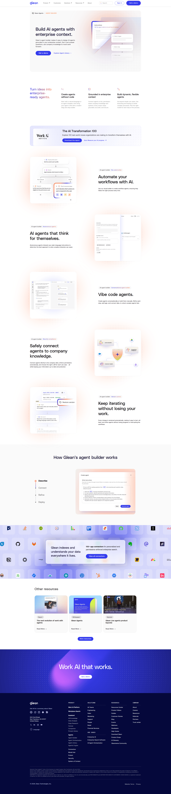
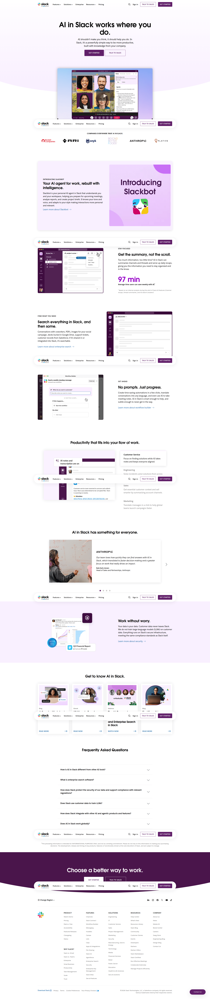
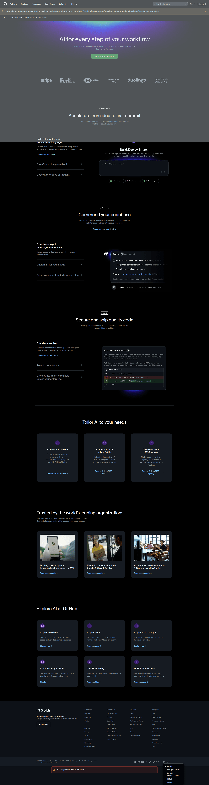
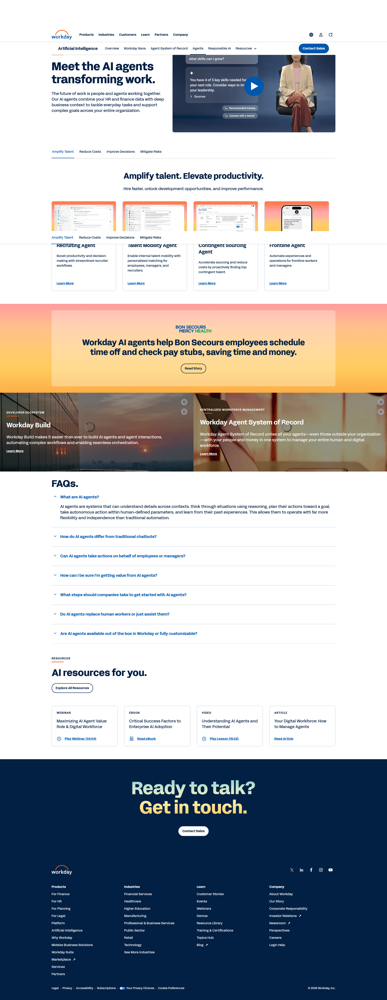

# 디자인 리서치: AX B2B 슬랙 에이전트 랜딩페이지

## 요약

Reliever는 일반적인 AI 컨설팅 회사처럼 보이기보다, 안전한 엔지니어링 인텔리전스 제품처럼 보여야 합니다. 가장 강한 레퍼런스들은 실제 제품 화면을 먼저 보여주고, 통합, 권한 기반 보안, 엔터프라이즈 배포 방식을 빠르게 증명합니다.

## 권장 방향

1. **슬랙 안에서 답하는 제품 순간을 첫 화면에 배치** - 제품은 대시보드가 아니라 설치형 슬랙 에이전트로 판매되므로, 레포지토리 질문에 답하는 장면을 히어로에서 보여주는 것이 가장 직접적입니다.

```text
+------------------------------------------------------+
| Reliever                         플랫폼 보안          |
+------------------------------------------------------+
| 기업 코드베이스를 이해하는 슬랙 기반 인텔리전스.      |
| [데모 문의] [배포 방식 보기]                          |
|                                                      |
|  # 엔지니어링-릴리스                                 |
|  질: 결제 마이그레이션 영향 서비스는?                |
|  답: invoice-api, plans-worker, ledger-sync...       |
+------------------------------------------------------+
```

2. **히어로 바로 아래에 통합 시스템을 노출** - Glean, Slack, GitHub는 모두 커넥터를 핵심 가치의 일부로 다룹니다. Reliever도 Slack, 레포지토리, 이슈 트래커, 문서 시스템을 초반에 보여줘야 합니다.

```text
+------------------------------------------------------+
| 엔지니어링 팀이 이미 쓰는 시스템과 연결됩니다         |
| [Slack] [GitHub] [GitLab] [Jira] [Linear] [문서]     |
+------------------------------------------------------+
```

3. **보안을 푸터가 아니라 전환 섹션으로 다루기** - 레포지토리 접근 승인이 필요한 엔터프라이즈 구매자는 읽기 전용 접근, 권한 인지 답변, 출처, 감사 가능성을 먼저 확인해야 합니다.

```text
+----------------------+-------------------------------+
| 신중한 레포지토리    | [x] 읽기 전용 설치            |
| 접근을 위한 설계     | [x] 권한 인지 답변            |
|                      | [x] 감사 기록                 |
|                      | [x] 전용 배포 옵션            |
+----------------------+-------------------------------+
```

4. **낮은 위험의 파일럿 구조로 상용화 흐름 제시** - 진단, 파일럿, 확장 흐름은 셀프서브 가입 중심 페이지보다 B2B AX 서비스에 더 잘 맞습니다.

```text
+--------------+--------------+--------------+
| 1주차        | 2-3주차      | 4주차 이후   |
| 진단         | 파일럿       | 확장         |
+--------------+--------------+--------------+
```

## 주요 레퍼런스


*Glean Agent Builder - 엔터프라이즈 에이전트 빌더 포지셔닝, 안전한 커넥터, 워크플로 자동화, 데모 중심 전환 버튼 참고. [Lazyweb]*


*Slack AI - 사용자가 이미 일하는 워크스페이스 안에서 AI 기능을 보여주는 방식 참고. [Lazyweb]*


*GitHub AI - 코드베이스 중심 AI 포지셔닝과 개발자 워크플로 신뢰도 표현 참고. [Lazyweb]*


*Workday AI Agents - 엔터프라이즈 에이전트 스토리텔링, 사용 사례, 자주 묻는 질문, 세일즈 전환 구조 참고. [Lazyweb]*


*Linear - 엔지니어링 대상 톤, 제품 UI 중심 구성, AI 에이전트 워크플로 표현 참고. [Lazyweb]*

## 공통 패턴

- 제품 UI가 초반에 등장합니다.
- 커넥터 언어가 구체적입니다. 앱, 레포지토리, 권한, 회사 지식이 명확히 언급됩니다.
- 보안은 구매자가 바로 볼 수 있는 영역에서 설명됩니다.
- 전환 버튼은 데모/세일즈 문의와 제품 탐색 경로로 나뉩니다.
- 좋은 페이지는 구체적인 제품 역할을 먼저 보여준 뒤 AI 전환 메시지를 확장합니다.

## 피해야 할 패턴

- 제품 화면 없이 추상적인 AI 컨설팅 문구만 반복하는 구성.
- Slack, 레포지토리, 워크플로를 보여주지 않는 장식용 추상 비주얼.
- 통제와 검토 경로를 설명하기 전에 자율 에이전트만 강조하는 메시지.
- 레포지토리 보안을 자주 묻는 질문이나 푸터에 늦게 배치하는 구조.
- 배포 서사 없이 기능 목록만 길게 나열하는 구성.

## Reliever만의 각도

- **슬랙을 명령 인터페이스로 사용:** 범용 엔터프라이즈 AI보다 더 구체적인 포지션을 만들 수 있습니다.
- **레포지토리 인텔리전스를 AX 근거로 전환:** 팀 단위 답변과 경영진용 전환 인사이트를 함께 제공합니다.
- **파일럿 우선 서비스 설계:** 4주 파일럿 흐름은 레포지토리 접근을 더 안전하고 관리 가능한 의사결정으로 만듭니다.
- **출처 기반 답변 UX:** 파일 출처, 오너, 신뢰도 신호가 핵심 제품 비주얼이 될 수 있습니다.

## 리서치 결과

Lazyweb에서 가장 적합한 결과는 Glean Agent Builder, Slack AI, GitHub AI, Workday AI Agents, Linear였습니다. 이 레퍼런스들은 공통적으로 추상적인 브랜드 메시지보다 제품 근거를 먼저 보여줍니다. 또한 엔터프라이즈 데이터와 AI가 관련된 경우 신뢰 섹션을 전환 경로의 핵심 요소로 사용합니다.

웹 리서치에서도 같은 패턴이 확인되었습니다. Glean은 엔터프라이즈 맥락, 안전한 커넥터, 권한 기반 거버넌스를 강조합니다. Slack은 기존 슬랙 워크플로 안에서 작동하고 접근 경계를 지키는 AI를 강조합니다. GitHub는 코드베이스를 단순 데이터 소스가 아니라 워크플로 가치의 중심으로 다룹니다.

따라서 Reliever 랜딩페이지는 다음을 우선해야 합니다.

- 레포지토리 질문에 답하는 슬랙 대화를 히어로에 배치.
- Slack, GitHub, GitLab, Jira, Linear, 문서 시스템의 통합 근거를 즉시 노출.
- 최종 전환 버튼 이전에 보안과 접근 통제 설명.
- 진단, 파일럿, 확장으로 이어지는 배포 흐름 제시.
- 넓은 AI 에이전시가 아니라 엔터프라이즈 제품화 서비스처럼 읽히는 카피.

## 출처

- Lazyweb 데스크톱 스크린샷 검색: Glean Agent Builder, Slack AI, GitHub AI, Workday AI Agents, Linear.
- Glean Agent Builder: https://www.glean.com/product/agent-builder
- Glean AI Agents: https://www.glean.com/product/ai-agents
- Slack AI: https://slack.com/features/ai
- Slack 엔터프라이즈 검색: https://slack.com/features/enterprise-search
- Slack AI 보안 도움말: https://slack.com/intl/en-gb/help/articles/28310650165907-Security-for-AI-features-in-Slack
- GitHub AI: https://github.com/features/ai
